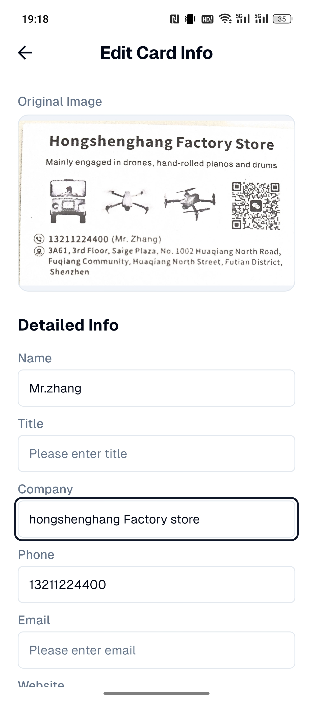
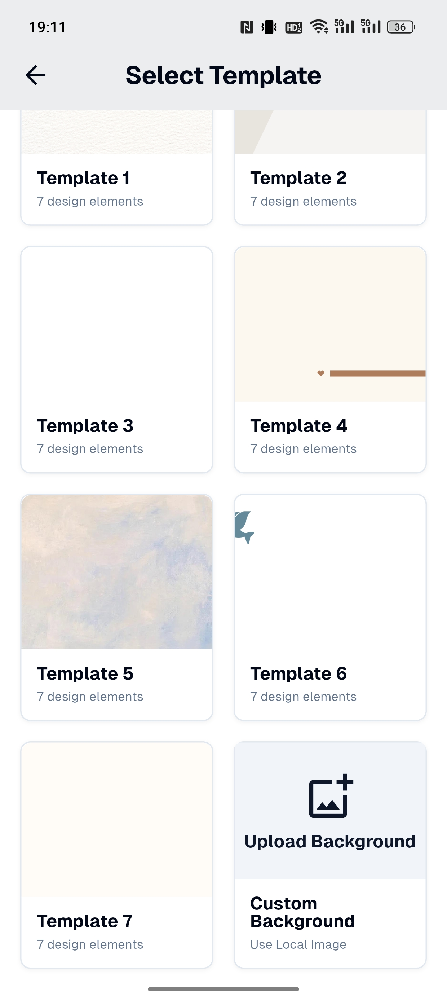
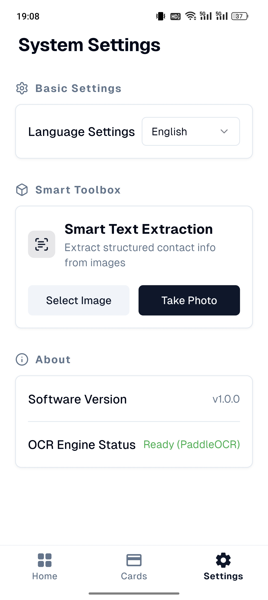

# 系统界面构成与功能说明

本章节详细介绍了“名片智造”系统的主要界面构成、功能职责以及用户交互流程。

## 1. 系统主界面

**功能说明：**
本界面是系统的核心入口，采用底部导航架构。顶部包含页面标题与搜索入口，中部为动态内容展示区，底部提供“首页”、“名片”、“设置”三大模块切换。悬浮按钮（FAB）作为高频操作入口，引导用户进行名片导入。

---

## 2. 名片列表展示

**功能说明：**
该界面展示了用户存储的所有名片信息。采用卡片式布局，直观显示姓名、职位、公司等关键字段。支持实时搜索过滤，方便用户在大量数据中快速定位目标联系人。

---

## 3. 快捷管理操作

**功能说明：**
系统集成了侧滑操作（Slidable）。用户通过向左滑动列表项，可以快速触发“分享”或“删除”功能。这种交互方式减少了点击层级，提升了管理效率。

---

## 4. 名片导入选项

**功能说明：**
点击导入按钮后弹出的底部面板。提供“拍照识别”、“相册导入”和“手动录入”三种模式。系统通过调用 PaddleOCR 插件对拍摄或选择的图片进行文字提取，实现信息的自动化采集。

---

## 5. 名片信息编辑

**功能说明：**
编辑界面用于对 OCR 识别结果进行校对和补充。用户可以对姓名、电话、邮箱、公司等结构化字段进行精细化编辑，确保录入信息的准确性。

---

## 6. 导入后的信息确认

**功能说明：**
在完成图片扫描和文字识别后，系统会自动跳转至此界面。它承载了从“原始图像”到“结构化数据”的转换结果，是用户完成数据入库前的关键确认环节。

---

## 7. 电子名片模板选择

**功能说明：**
系统内置多种精美的名片模板。用户可以将识别出的信息套用至不同风格的模板中，生成美观的电子名片，满足不同商务场景的展示需求。

---

## 8. 个人名片管理

**功能说明：**
用户可以在此维护自己的个人信息。通过设置个人电子名片，可以方便地生成专属二维码，实现快速社交分享。

---

## 9. 二维码分享功能

**功能说明：**
系统支持将名片信息转化为标准格式的二维码。其他用户只需通过手机扫描，即可快速将联系人信息保存至通讯录，实现了数字化的社交对接。

---

## 10. 系统设置

**功能说明：**
设置界面提供多语言切换（中英文）、OCR 引擎状态查看以及关于系统等配置选项。用户可以根据使用习惯调整系统偏好，保证应用在不同环境下的适配性。
